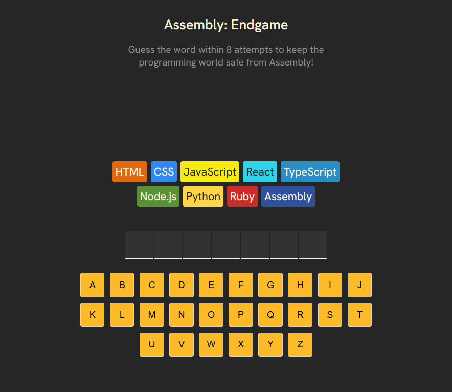
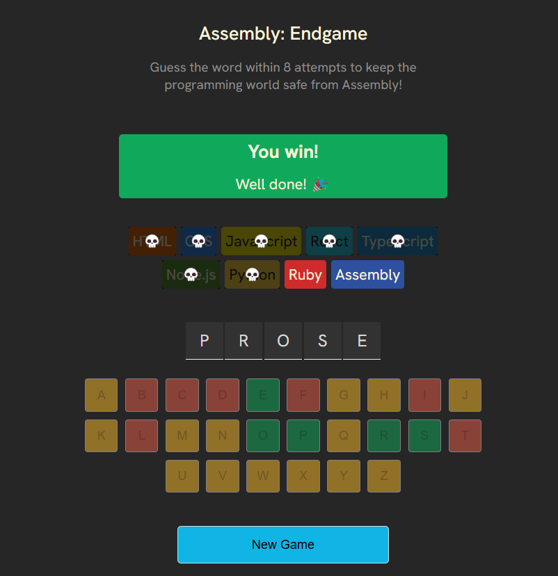
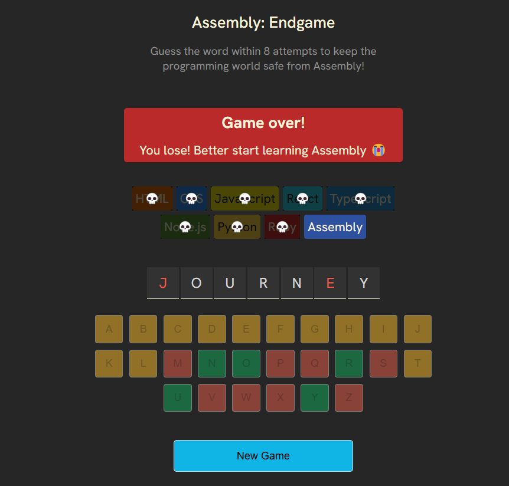

## Assembly: Endgame - A Word-Guessing Adventure! 🎮

🌟 Welcome to Assembly: Endgame, a fun and challenging word-guessing game where every wrong guess gets you closer to Assembly—the ultimate boss language!  
🚀 Created as part of my React learning journey on Scrimba, this project blends coding, strategy, and fun into one thrilling experience. 🎉  

🌐 Play the Game

🎮 Play Assembly: Endgame [Online](https://tenziesgameplay.netlify.app/).

🔥 Features

🎯 Dynamic Gameplay: Reveal letters or lose programming languages with every guess.  
✨ Confetti Celebration: Win the game and celebrate your success in style!  
🎨 Visual Feedback: Real-time UI updates to keep you immersed.  
🧠 Challenging Logic: Test your word skills and programming knowledge.  

💻 Tech Stack

► React: For a responsive and interactive UI.  
► CSS: To bring the visuals to life.  
► JavaScript: Powers the game’s logic and functionality.  

🎮 How to Play

► Guess a Letter: Start guessing letters to reveal the hidden word.  
► Keep Track: Wrong guesses eliminate programming languages one by one.  
► Win or Lose: Guess the word before Assembly takes over—or face defeat!  

🌟 Skills Gained

► React hooks and state management. ⚛️  
► Using clsx for dynamic class handling. 🖍️  
► Creating accessible interfaces with aria attributes. 🧩  
► Real-time UI updates and animations. ✨  

🤝 Contributions
Got ideas or improvements? Fork the repo, report issues, or submit pull requests! Let’s make this even better. 💡

